## [3-3. Flash Mobile申込フロー](03_APP_03.MD)
* [Flow URL Link](static/flash_mobile_flow.svg)

* [フローURLリンク](static/flash_mobile_flow.svg)

### [3-3-1. 申込み前のチェックリスト](https://s3.amazonaws.com/acnjpn/back_office/images/training/FLASH_M_Checklist_MNP.pdf)
* URLリンク: [https://s3.amazonaws.com/acnjpn/back_office/images/training/FLASH_M_Checklist_MNP.pdf](https://s3.amazonaws.com/acnjpn/back_office/images/training/FLASH_M_Checklist_MNP.pdf)

### [3-3-1. Items to check before application](https://acnjpn.s3.amazonaws.com/back_office/images/training/FLASH_M_Checklist_MNP_ENG.pdf)
* URL Link: [https://acnjpn.s3.amazonaws.com/back_office/images/training/FLASH_M_Checklist_MNP_ENG.pdf](https://acnjpn.s3.amazonaws.com/back_office/images/training/FLASH_M_Checklist_MNP_ENG.pdf)

### [3-3-2. 対応端末一覧](https://flashcorp.co.jp/support/mobile/devices/index.html)
* URLリンク: [https://flashcorp.co.jp/support/mobile/devices/index.html](https://flashcorp.co.jp/support/mobile/devices/index.html)

### [3-3-2. Supported Devices](https://flashcorp.co.jp/support/mobile/devices/index.html)
* URLリンク: [https://flashcorp.co.jp/support/mobile/devices/index.html](https://flashcorp.co.jp/support/mobile/devices/index.html)

### [3-3-3. SIMロック解除](https://flashcorp.co.jp/support/mobile/unlock/modal_unlock.html)
* URLリンク: [https://flashcorp.co.jp/support/mobile/unlock/modal_unlock.html](https://flashcorp.co.jp/support/mobile/unlock/modal_unlock.html)

### [3-3-3. Unlock SIM](https://flashcorp.co.jp/support/mobile/unlock/modal_unlock.html)
* URLリンク: [https://flashcorp.co.jp/support/mobile/unlock/modal_unlock.html](https://flashcorp.co.jp/support/mobile/unlock/modal_unlock.html)

### [3-3-4. MNPの取得方法](https://flashcorp.co.jp/support/mobile/mnp/modal_mnp.html)
* URLリンク: [https://flashcorp.co.jp/support/mobile/mnp/modal_mnp.html](https://flashcorp.co.jp/support/mobile/mnp/modal_mnp.html)

### [3-3-4. How to get MNP](https://flashcorp.co.jp/support/mobile/mnp/modal_mnp.html)
* URLリンク: [https://flashcorp.co.jp/support/mobile/mnp/modal_mnp.html](https://flashcorp.co.jp/support/mobile/mnp/modal_mnp.html)

### [3-3-5. WebでFlash Mobile申込の手順書](https://s3.amazonaws.com/acnjpn/back_office/images/training/FLASH_enrollment_steps.pdf)
* URLリンク: [https://s3.amazonaws.com/acnjpn/back_office/images/training/FLASH_enrollment_steps.pdf](https://s3.amazonaws.com/acnjpn/back_office/images/training/FLASH_enrollment_steps.pdf)

### [3-3-5. Flash Mobile Application Guidebook](https://s3.amazonaws.com/acnjpn/back_office/images/training/FLASH_enrollment_steps.pdf)
* URLリンク: [https://s3.amazonaws.com/acnjpn/back_office/images/training/FLASH_enrollment_steps.pdf](https://s3.amazonaws.com/acnjpn/back_office/images/training/FLASH_enrollment_steps.pdf)

### [3-3-6. かんたん設定ガイドPDF](https://s3.amazonaws.com/acnjpn/back_office/images/training/FLASH_M_kantanguide.pdf)
* URLリンク: [https://s3.amazonaws.com/acnjpn/back_office/images/training/FLASH_M_kantanguide.pdf](https://s3.amazonaws.com/acnjpn/back_office/images/training/FLASH_M_kantanguide.pdf)

### [3-3-6. Flash Mobile Settings](https://s3.amazonaws.com/acnjpn/back_office/images/training/FLASH_M_kantanguide.pdf)
* URLリンク: [https://s3.amazonaws.com/acnjpn/back_office/images/training/FLASH_M_kantanguide.pdf](https://s3.amazonaws.com/acnjpn/back_office/images/training/FLASH_M_kantanguide.pdf)

## [ACN IBO共有情報](00_FAQ.MD)