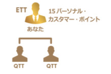

## [3. ３０日ETTボーナス達成ための「Working Backwards」逆引き解決法](13_ETT_JP.MD)

### 3-1. ３０日ETTボーナスを達成するには
* ２名以上の新規IBO加入
* ２名以上の新規IBOが３点以上商品を契約し、QTT達成
* ETT的チャレンジするIBOが１５ｐ以上の個人ポイント達成

### 3-2. IBO事業説明の予約
* 統計情報によると、１０名候補者に声かけたら、そのうち２名がIBOになる
* 新規IBOがQTTになるまで１ー２週間かかるため、最初の２週間は１０名以上の候補者に声かける必要がある

### 3-3. 新規IBOがQTTになるまでのガイダンス
* 可能の限り、１週間以内にQTTを完成することをガイドする
* 詳細は「１．IBO新規登録後のガイドステップ」

### 3-4. 個人ポイント（顧客）を獲得し続ける
* １５ｐ以上の個人ポイント達成

## [ACN IBO情報ポータル](10_GID.MD)