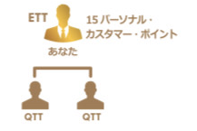

## [4. 達成30天ETT獎金的「Working Backwards」逆向工程法](14_ETT_CN.MD)

### 4-1. 完成30天ETT獎金需要做到
* 邀請至少2位以上的IBO
* 2位以上的IBO，每位都簽約至少3點以上商品而成為QTT
* ETT的IBO个人積分達到15分以上

### 4-2. IBO邀約嘗試
* 从邀约开始算每和10个朋友聊过，有2位加入IBO是正常几率。
* 考慮到新加入的IBO要成為QTT也可能需要1-2週，前兩週需要發起10次以上邀約嘗試。

### 4-3. 幫助新加入IBO完成QTT
* 盡力協助新IBO一週內完成QTT
* 具體參照「２．IBO新規登録後的輔導步驟」

### 4-4. 持續增加個人積分
* 个人積分達到15分以上

## [ACN IBO情報ポータル](10_GID.MD)